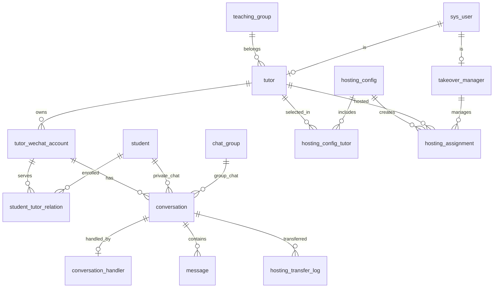

# 消息托管系统 — 数据库设计（已确认）

## 1. 业务背景

| 维度 | 说明 |
|------|------|
| 辅导老师 | 约 100 位，每人约 10 名学生 |
| 沟通渠道 | 企业微信（调用企微 API 收发消息） |
| 核心能力 | 部分「接管者」代为回复其他辅导老师的企微消息 |
| 托管粒度 | **整位辅导老师**（名下所有企微账号、私聊 + 群聊一并托管） |
| 约束 | 同一辅导老师同一时刻只能被 1 位接管者托管；托管生效后原辅导老师不可回复 |

---

## 2. 已确认的业务规则

| # | 决策 |
|---|------|
| 1 | 辅导老师、接管者、管理员共用 `sys_user` |
| 2 | 托管粒度：**整位辅导老师**（名下全部企微账号） |
| 3 | 私聊与群聊**一起托管**，不单独配置 |
| 4 | 学生阶段：**转化期 / 承接期 / 已结课**（值：1 / 2 / 3） |
| 5 | 工作台「转接」= 将**单个聊天**转给其他老师处理 |
| 6 | 消息本地保留 **1 个月**，超期定时清理 |
| 7 | 配置支持**立即生效 / 定时生效**，无自动结束时间，需手动结束 |

---

## 3. 模块与表映射

| 系统模块（UI） | 主要涉及表 |
|----------------|------------|
| 接管配置 | `hosting_config`、`hosting_config_tutor`、`hosting_assignment` |
| 辅导老师管理 | `tutor`、`tutor_wechat_account`、`student`、`student_tutor_relation` |
| 接管者管理 | `takeover_manager` |
| 转接记录 | `hosting_transfer_log` |
| 消息工作台 | `conversation`、`conversation_handler`、`message`、`message_read_status` |
| 群聊 | `chat_group`、`chat_group_member` |
| 基础数据 | `teaching_group`、`sys_user` |

---

## 4. ER 关系概览



---

## 5. 表清单（共 17 张）

### 5.1 基础与用户

#### `teaching_group` — 教研组

| 字段 | 类型 | 说明 |
|------|------|------|
| id | BIGINT PK | 主键 |
| name | VARCHAR(64) | 教研组名称 |
| sort_order | INT | 排序 |
| status | TINYINT | 0-禁用 1-启用 |
| created_at / updated_at | DATETIME | 时间戳 |

#### `sys_user` — 系统用户

| 字段 | 类型 | 说明 |
|------|------|------|
| id | BIGINT PK | 主键 |
| username | VARCHAR(64) UNIQUE | 登录名 |
| password_hash | VARCHAR(128) | 密码哈希 |
| real_name | VARCHAR(32) | 真实姓名 |
| phone | VARCHAR(20) | 手机号 |
| avatar_url | VARCHAR(512) | 头像 |
| role | TINYINT | 1-管理员 2-辅导老师 3-接管者 |
| status | TINYINT | 0-禁用 1-启用 |
| last_login_at | DATETIME | 最后登录 |
| created_at / updated_at | DATETIME | 时间戳 |

#### `tutor` — 辅导老师

| 字段 | 类型 | 说明 |
|------|------|------|
| id | BIGINT PK | 主键 |
| user_id | BIGINT FK → sys_user | 关联系统用户 |
| teaching_group_id | BIGINT FK → teaching_group | 所属教研组 |
| employee_no | VARCHAR(32) | 工号 |
| status | TINYINT | 0-离职 1-在职 |
| created_at / updated_at | DATETIME | 时间戳 |

#### `takeover_manager` — 接管者

| 字段 | 类型 | 说明 |
|------|------|------|
| id | BIGINT PK | 主键 |
| user_id | BIGINT FK → sys_user | 关联系统用户 |
| max_tutor_count | INT DEFAULT 10 | 最大可接管辅导老师数 |
| status | TINYINT | 0-禁用 1-启用 |
| created_at / updated_at | DATETIME | 时间戳 |

---

### 5.2 企微账号与学生

#### `tutor_wechat_account` — 辅导企微账号

> 一位辅导老师可有多个企微账号；托管时随辅导老师一并纳入，无需单独选择。

| 字段 | 类型 | 说明 |
|------|------|------|
| id | BIGINT PK | 主键 |
| tutor_id | BIGINT FK → tutor | 所属辅导老师 |
| account_name | VARCHAR(64) | 账号展示名 |
| subject | VARCHAR(32) | 科目 |
| grade | VARCHAR(32) | 年级 |
| wechat_userid | VARCHAR(64) | 企微成员 userid |
| corp_id | VARCHAR(64) | 企业 ID |
| agent_id | VARCHAR(64) | 应用 agentId |
| student_count | INT | 学生数（冗余） |
| status | TINYINT | 0-停用 1-正常 |
| created_at / updated_at | DATETIME | 时间戳 |

#### `student` — 学生

| 字段 | 类型 | 说明 |
|------|------|------|
| id | BIGINT PK | 主键 |
| nickname | VARCHAR(64) | 昵称 |
| avatar_url | VARCHAR(512) | 头像 |
| external_userid | VARCHAR(64) UNIQUE | 企微外部联系人 ID |
| grade | VARCHAR(32) | 年级 |
| status | TINYINT | 0-无效 1-正常 |
| created_at / updated_at | DATETIME | 时间戳 |

#### `student_tutor_relation` — 学生-辅导账号关系

| 字段 | 类型 | 说明 |
|------|------|------|
| id | BIGINT PK | 主键 |
| student_id | BIGINT FK → student | 学生 |
| tutor_account_id | BIGINT FK → tutor_wechat_account | 辅导企微账号 |
| subject | VARCHAR(32) | 科目 |
| grade | VARCHAR(32) | 年级 |
| stage | TINYINT | **1-转化期 2-承接期 3-已结课** |
| status | TINYINT | 0-结束 1-进行中 |
| assigned_at | DATETIME | 分配时间 |
| created_at / updated_at | DATETIME | 时间戳 |

---

### 5.3 群聊

#### `chat_group` / `chat_group_member`

结构与上一版相同。群聊会话随辅导老师托管一并移交。

---

### 5.4 会话与消息

#### `conversation` — 会话

| 字段 | 类型 | 说明 |
|------|------|------|
| id | BIGINT PK | 主键 |
| tutor_account_id | BIGINT FK | 所属企微账号 |
| conv_type | TINYINT | 1-私聊 2-群聊 |
| student_id | BIGINT | 私聊学生 |
| group_id | BIGINT | 群聊 |
| last_message_id / last_message_at / last_message_preview | | 列表展示 |
| stage | TINYINT | 1-转化期 2-承接期 3-已结课 |
| status | TINYINT | 0-归档 1-活跃 |
| created_at / updated_at | DATETIME | 时间戳 |

#### `conversation_handler` — 会话当前处理人（新增）

> 托管生效时，该辅导老师名下所有会话默认分配给接管者；「转接」时更新此表。

| 字段 | 类型 | 说明 |
|------|------|------|
| id | BIGINT PK | 主键 |
| conversation_id | BIGINT FK → conversation UNIQUE | 会话（每会话唯一一条） |
| handler_user_id | BIGINT FK → sys_user | 当前处理人 |
| handler_type | TINYINT | 1-接管者 2-原辅导老师 |
| hosting_assignment_id | BIGINT FK | 关联托管关系（转接后可为空） |
| assigned_at | DATETIME | 分配/转接时间 |
| created_at / updated_at | DATETIME | 时间戳 |

#### `message` — 消息

| 字段 | 类型 | 说明 |
|------|------|------|
| id | BIGINT PK | 主键 |
| conversation_id | BIGINT FK | 会话 |
| msg_id | VARCHAR(64) UNIQUE | 企微消息 ID |
| sender_type | TINYINT | 1-学生 2-老师/接管者 3-系统 |
| sender_id | BIGINT | 发送者 ID |
| content_type | TINYINT | 1-文本 2-图片 3-文件 4-语音 |
| content | TEXT | 内容 |
| media_url | VARCHAR(512) | 媒体地址 |
| sent_at | DATETIME | 发送时间（**清理依据**） |
| created_at | DATETIME | 入库时间 |

**保留策略：** 定时任务删除 `sent_at < NOW() - INTERVAL 1 MONTH` 的记录。

#### `message_read_status` — 消息已读

按处理人（`sys_user.id`）维护各会话未读数，结构不变。

---

### 5.5 托管配置与转接

#### `hosting_config` — 接管配置

| 字段 | 类型 | 说明 |
|------|------|------|
| id | BIGINT PK | 主键 |
| takeover_manager_id | BIGINT FK | 接管者 |
| effective_type | TINYINT | 1-立即生效 2-定时生效 |
| scheduled_start_at | DATETIME | 定时生效时间 |
| description | VARCHAR(512) | 接管说明 |
| status | TINYINT | 0-草稿 1-待生效 2-生效中 3-已结束 4-已取消 |
| created_by | BIGINT FK | 创建人 |
| created_at / updated_at | DATETIME | 时间戳 |

> 无 `scheduled_end_at`，结束托管需管理员/操作人手动触发。

#### `hosting_config_tutor` — 配置所选辅导老师（替代原 account 表）

| 字段 | 类型 | 说明 |
|------|------|------|
| id | BIGINT PK | 主键 |
| hosting_config_id | BIGINT FK | 配置 |
| tutor_id | BIGINT FK → tutor | 被选中的辅导老师 |
| skip_reason | VARCHAR(128) | 跳过原因（已被他人托管） |
| status | TINYINT | 0-跳过 1-待生效 2-已生效 |

#### `hosting_assignment` — 当前生效托管关系

> **核心约束：** `tutor_id` 在 `status=1` 时全局唯一。

| 字段 | 类型 | 说明 |
|------|------|------|
| id | BIGINT PK | 主键 |
| hosting_config_id | BIGINT FK | 来源配置 |
| tutor_id | BIGINT FK → tutor | **被托管辅导老师** |
| takeover_manager_id | BIGINT FK | 接管者 |
| started_at | DATETIME | 生效开始 |
| ended_at | DATETIME | 手动结束时间 |
| status | TINYINT | 1-进行中 2-已结束 |
| created_at / updated_at | DATETIME | 时间戳 |

**生效逻辑：** 创建 `hosting_assignment` 后，批量为该辅导老师名下所有 `conversation` 写入 `conversation_handler`。

#### `hosting_transfer_log` — 转接记录

| 字段 | 类型 | 说明 |
|------|------|------|
| id | BIGINT PK | 主键 |
| tutor_id | BIGINT FK | 所属辅导老师 |
| conversation_id | BIGINT FK | 被转接的会话 |
| from_handler_user_id | BIGINT | 原处理人 |
| to_handler_user_id | BIGINT | 新处理人 |
| action_type | TINYINT | 1-开始托管 2-结束托管 **3-转接聊天** |
| operator_id | BIGINT FK | 操作人 |
| remark | VARCHAR(512) | 备注 |
| created_at | DATETIME | 操作时间 |

---

## 6. 关键业务流程

### 6.1 创建托管配置

```
选择辅导老师 → 选择接管者 → 立即/定时生效
  → 校验 tutor 是否已被托管（是则 skip）
  → 写入 hosting_config + hosting_config_tutor
  → 生效时创建 hosting_assignment
  → 批量初始化 conversation_handler（该老师所有私聊+群聊 → 接管者）
```

### 6.2 工作台转接聊天

```
当前处理人点击「转接」→ 选择目标老师（接管者）
  → 更新 conversation_handler.handler_user_id
  → 写入 hosting_transfer_log (action_type=3)
  → 目标老师工作台出现该会话
```

### 6.3 发消息权限校验

```
查 conversation_handler → 当前 handler_user_id 才允许回复
若 tutoring 未托管 → 原辅导老师可回复
若 tutoring 已托管 → 仅 handler 可回复
```

### 6.4 消息清理（定时任务）

```sql
DELETE FROM message WHERE sent_at < DATE_SUB(NOW(), INTERVAL 1 MONTH);
-- 建议分批删除，避免长事务
```

---

## 7. 数据量预估

| 实体 | 数量级 |
|------|--------|
| 辅导老师 | ~100 |
| 企微账号 | ~100–300 |
| 学生 | ~1,000 |
| 会话 | ~1,000+ |
| 消息（滚动 1 个月） | 按日活估算，有上限 |

---

## 8. 文件说明

| 文件 | 说明 |
|------|------|
| `sql/schema.sql` | 可执行建库建表脚本（数据库名：`wechat`） |
| `sql/cleanup_message.sql` | 消息 1 个月清理脚本（参考） |

---

## 9. 下一步

1. 在 MySQL 执行 `schema.sql`
2. 生成 Spring Boot Entity / MyBatis Mapper
3. 实现定时任务：托管定时生效、消息清理
4. 补充 seed 测试数据（可选）
